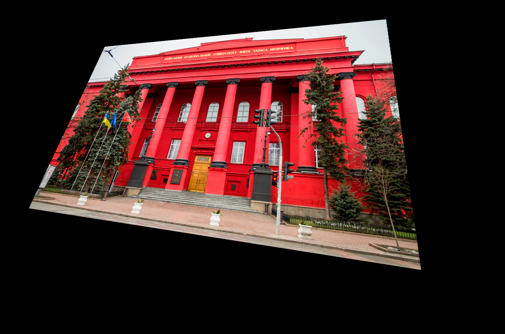
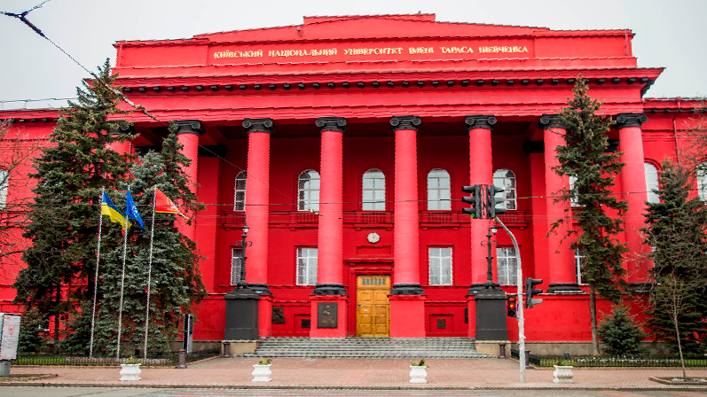

# ImageHomography
Giving poins: (299, 134), (1096,57), (1197, 768), (84, 592); and 16:9 ratio.

It was:

It became:

## Perfomance on Ryzen 1700
| Type   | ~Time (sec) |
|--------|-------------|
| Serial | 7.7         |
| OpenMP | 7           |
| MPI    | 1           |
